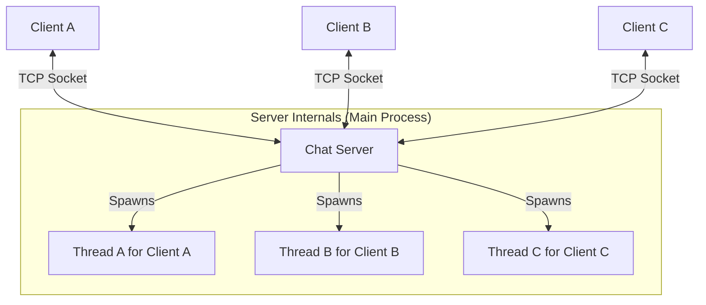

# PyNet Chat Service Architecture Document (Phase 1)

## 1. High-Level Architecture

The architecture for Phase 1 is a **Centralized Client-Server model**, also known as a **Hub-and-Spoke** architecture.

*   **The Hub (Server):** A single Python process that acts as the central message router. It accepts connections, maintains a list of active clients, and broadcasts messages. It is the single source of truth.
*   **The Spokes (Clients):** Individual Python scripts that connect directly to the Hub. Clients do not communicate with each other directly; all communication is relayed through the server.

This design is simple, robust for a basic implementation, and allows for centralized control and logging.



## 2. The Communication Protocol (Layer 7)

All communication between the client and server MUST be in a structured **JSON format**, encoded to `utf-8` bytes for network transmission.

### A. Client Sends "Join" (Handshake)
This is the first message a client sends after connecting to register its username.

```json
{
  "type": "join",
  "data": "Alice"
}
```

### B. Client Sends a Chat Message
This is the standard message format for sending a chat message to the room.

```json
{
  "type": "chat",
  "data": "Hello World!"
}
```

### C. Server Broadcasts a Message
When the server receives a chat message, it relays it to all other clients using this format.

```json
{
  "type": "message",
  "from": "Alice",
  "data": "Hello World!"
}
```

## 3. Data Flow (The "Happy Path")

1.  **Connect:** A client script is run and establishes a TCP connection to the server's IP and port.
2.  **Handshake:** The client immediately sends a `join` type JSON message with its desired username.
3.  **Registration:** The server receives the `join` message, creates a dedicated thread for this new client, and stores the client's socket object and username in an in-memory dictionary or list.
4.  **Action:** A user on a client script types a message and hits Enter. The client script wraps this message in a `chat` type JSON and sends it to the server.
5.  **Processing:** The server's dedicated thread for that client receives the JSON, decodes it, and identifies it as a `chat` message.
6.  **Broadcast:** The server iterates through its list of all connected clients (excluding the sender) and sends them a `message` type JSON, attributing the message to the original sender.

## 4. Technical Constraints & Decisions

*   **Buffer Size:** Network receive operations should use a buffer of `1024` bytes. Messages longer than this will be handled by subsequent `recv` calls within the stream.
*   **Encoding:** All string-to-byte conversions MUST use `'utf-8'`.
*   **Concurrency:** The server will use Python's built-in `threading` library. A new thread will be spawned for each client to handle its I/O operations, preventing the main server loop from blocking.
*   **Disconnect Handling:** The server must wrap its send/receive operations in a `try...except` block. If an exception (like a `ConnectionResetError`) occurs, it signifies a client has disconnected. The server must then gracefully close that client's socket and remove them from the list of active clients.


**Stories (in implementation order):**
1.  **Story 1.1: The Listening Server:** As a Dev, I want to create a `server.py` that can listen for incoming TCP connections on a specified port, so that clients have a target to connect to.
2.  **Story 1.2: The Connecting Client:** As a User, I want to run `client.py` to connect to the server's IP and port, so that I can join the chat system.
3.  **Story 1.3: The Server "Greeter":** As a Dev, I want the server to accept a new connection and start a dedicated thread for that client, so that it's ready for concurrent communication.
4.  **Story 1.4: The Client "Handshake":** As a User, I want the client to prompt me for a username and send a `join` JSON message to the server, so I can identify myself.
5.  **Story 1.5: The Chat Loop:** As a User, I want to be able to type messages into my client and have them sent to the server in the correct `chat` JSON format.
6.  **Story 1.6: The Broadcaster:** As a Dev, I want the server, upon receiving a message, to broadcast it to all other connected clients.
7.  **Story 1.7: The Receiver:** As a User, I want my client to listen for and display messages broadcast from the server, so I can see the conversation.
8.  **Story 1.8: Graceful Shutdown:** As a Dev, I want the server to correctly handle a client disconnecting, so that the server doesn't crash.